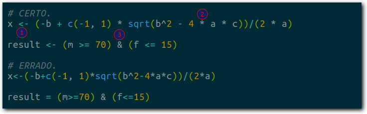
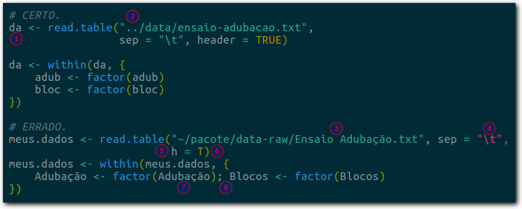
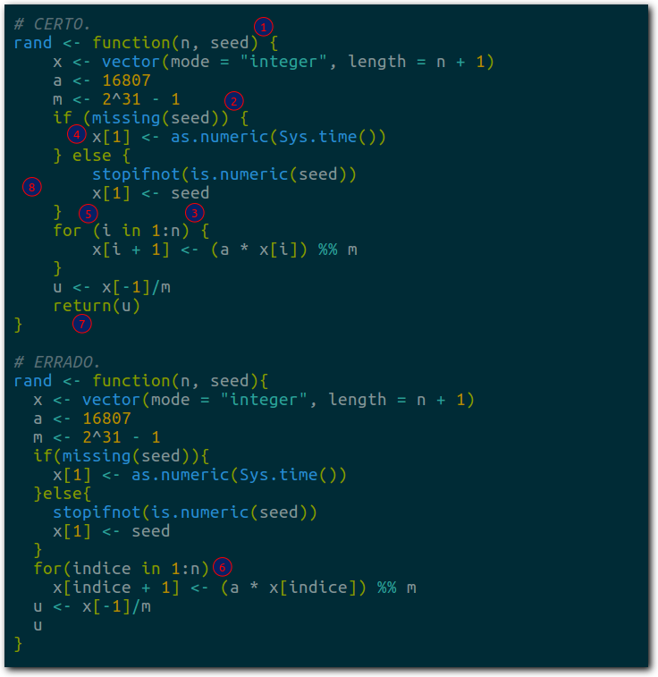

---
output:
  html_document:
    toc: true 
    toc_float: true
    number_sections: true
    
---
.

#Guia de Contribuição
O Guia de Contribuição e Estilo serve para orientar a forma de trabalhar que seja eficiente, padronizada, coordenada e segura e produza conteúdo de qualidade. Este guia contém orientações de como escrever o código e escrever a documentação.

#Conjunto de Dados
Para um melhor aproveitamento dos projetos coletivos do PET é recomendado o uso do [LabestData](https://gitlab.c3sl.ufpr.br/pet-estatistica/labestData) quando for necessário o uso de um conjunto de dados. 
Utilize a função `library(labestData)`.

#Divisão dos Capítulos
| Capítulo                   | Integrante Responsável  |
|----------------------------+----------------|
| Capítulo 1                       | Igor           |
| Capítulo 2                     | Jayme           |
| Capítulo 3                      | Igor          |
| Capítulo 4                    | Altamiro          |
| Capítulo 5              | Welton          |
| Capítulo 6                  | Guilherme           |
| Capítulo 7                 | Indefinido         |

#BookDown

Para a escrever a apostila R utilizaremos o recurso [BookDown](https://bookdown.org/) que é um pacote R livre e de código aberto construído sobre o R Markdown para tornar fácil escrever livros e artigos. Que torna possível a distribuição da Apostila R em vários formatos (PDF, HTML e EPUB, etc), assim deixando o leitor escolher o seu formato preferido e a leitura compatível com qualquer meio eletrônico.

#Escrita formal

Utilizaremos a terceira pessoa em toda a apostila R.

# Estilo de Escrita

Os números circulados de vermelhos nas imagens abaixo indicam diferenças
entre os padrões de escrita de código R. Os dois fragmentos de código
fazem a mesma coisa, funcionam igualmente, porém o primeiro é o padrão
adotado na Apostila R.

1. Use o operador `<-` e não o operador `=` para atribuir conteúdo aos
   objetos. Deixe espaço ao redor do operador `<-`. Isso resolve a
   ambiguidade: `x<-2 ` é `x < -2` ou `x <- 2`?
2. Use espaço ao redor dos operadores matemáticos: exceto `^` e `/`,
   todos os demais tem espaços ao redor: `+ - * %% %/% %*%`. Um caso
   particular é o `-` que não tem espaço quando é o negativo (`-5 * 2`)
   mas tem quando é o menos (`2 - 5`).
3. Use espaço ao redor dos operadores lógicos:
   `== != > >= < <= & && | || %in%`.

1. Use espaço para separar o argumento do valor que ele recebe.
2. Sempre use espaço após a vírgula e nunca use antes dela.
3. A regra para a vírgula vale dentro de colchetes também. Duas vírgulas
   não ficam coladas.
4. Use aspas duplas. Usuários experientes afirmam que a dupla é mais
   visível por ser um caractere mais cheio. Na linguagem R não existe
   nenhuma diferença de função entre elas, para outras, como o Shell,
   existe e deixa de ser uma questão estética mas funcional.
5. Em algumas linguagens de programação há quem goste do estilo *comma
   first*. No entanto, além de não haver um argumento forte para, não é
   esse o padrão adotado pelos programadores de R. Não use *comma
   first*.

1. Acostume-se a usar nomes curtos. A chance de erro de digitação com
   nomes curtos é menor. Tente abreviações e siglas para definir os seus
   objetos, evitando nomes que excedam 6 caracteres. O caso de nomes de
   função em pacote é uma exceção, pois nomes curtos demais podem não
   ser difícil de recordar ou de adivinhar o significado dele. Quando
   houver necessidade de nome composto, pode ser usado `.` e o
   `_`. Existe uma preferência para que nomes de funções em pacotes usem
   o `_` porque o `.` é usado na construção de funções método.
2. Use endereços relativos porque isso deixa o código com
   mais portabilidade.
3. Evite 1) espaço no nome de diretórios e arquivos, 2) evite caracteres
   acentuados (não ASCII) e 3) evite letras maiúsculas para diminuir os
   erros de digitação. No lugar dos espaços recomenda-se usar
   *underline* ou traço.
4. Evite ultrapassar 72 caracteres no comprimento das linhas do
   código. Isso deixa seu código mais vertical e legível, não esconde
   texto para monitores de pequena resolução, evita quebras de linhas
   acidentais quando o texto é colado em processadores de texto (me
   pergunto para que alguém faz isso[^1]) ou se e-mail.
5. Não abrevie o nome dos argumentos. Você pode até ganhar
   microssegundos de tempo com isso, mas o seu código fica menos
   portável (mais sujeito a erro e ambiguidade) além de ser menos
   compreendido por um usuário não familiar com a linguagem ou com a
   função que você está usando.
6. Nunca abrevie para `T` ou `F` os valores lógicos `TRUE` e `FALSE`. Os
   últimos são palavras reservadas do sistema mas os primeiros são
   apenas objetos, ou seja, nada impede de fazer `T <- 10` e isso seria
   desastroso para que abrevia `TRUE` com `T`.
7. Evite definir objetos ou nomes das variáveis em `data.frames` com
   maiúsculas. O R é *case sensitive* e as chances de erro de digitação
   são maiores.
8. Evite usar `;` e faça quebra de linha para deixar o código mais
   vertical. Ele é um operador que permite escrever duas instruções na
   mesma linha mas isso faz crescer horizontalmente, pode ultrapassar as
   margens.

1. Nas construções como `function`, `if`, `for`, `while`, etc, deixe
   espaço entre o parentese direito e chave esquerda.
2. O padrão de uso de chaves no R é o [K&R] 1TBS (*the one true brace
   style*). Nesse padrão de chave, o construtor (`if`, `for`, `while`,
   etc) antecede a chave que abre e chave que fecha fica sozinha na
   linha (indentada com o construtor), a menos que esteja acompanhada de
   um cláusula `else`, de outra chave ou parêntese.
3. Idem ao 1 e 2.
4. Deixe espaço entre o nome do construtor e o parêntese que abre. A
   única exceção é para `function`.
5. Idem ao 4.
6. Evite deixar as construções como `function`, `if`, `for`, `while`,
   sem as chaves mesmo que o corpo seja uma linha curta. As chaves
   evitam que linhas adicionadas acidentalmente provoquem erros e
   deixa seu código mais claro.
7. Use o `return` no final das suas funções porque isso marca melhor o
   que a função retorna. Usuários não familiares agradecem.
8. A indentação padrão no R é com 4 espaços (e não com TAB). O RStudio,
   por exemplo, vem com 2 espaços por padrão. Mude isso no
   `Global Options > Code > Editing`. Os mais experientes dizem que 4
   espaços dá mais evidência da hierarquia do código.

1. Definitivamente use `library` e não `require`. Apesar do último
   parecer mais lógico por ser um verbo, `library` é que carrega um
   pacote. Se o pacote não estiver presente, a `library` retorna um
   **Error** (!) e a `require` retorna um `FALSE`.
2. O `~` é um operador como o `-`: tem espaço se existe um objeto que o
   precede, caso contrário não tem.
3. Prefira notação científica nos gráficos. Uma grande vantagem do R é
   permitir anotação matemática nos gráficos. Use sempre que possível,
   principalmente quando os gráficos vão para uma
   monografia/disertação/tese ou artigo.

1. Para seu próprio benefício, comente o seu código. Os comentários vão
   te guiar no futuro quando sua memória falhar. Encare o seus
   comentários como um texto normal e siga as regras do idioma que
   adotar usar: acentue, comece com maiúscula, termine com ponto.
2. Quando for o caso, separe o seu código em "seções temáticas". Use
   algo para destacar isso, como uma linha horizontal. No Emacs é
   bastante fácil fazer essas linhas horizontal como o mesmo
   comprimento[^2].
3. Deixe linhas em branco para separar o código. Não empilhe código que
   não seja logicamente conectado pois os espaços funcionam como o
   intervalo entre dois parágrafos de texto.
4. Use o mesmo número de caracteres para fazer comentários. Todos os
   editores de R usam um sinal de `#`, que é mais barato. Só o Emacs que
   usa dois sinais de comentários para o R, lisp e outras linguagens
   porque no Emacs o número de sinais tem função para indentação. Mas
   isso é customizável e recomenda-se que você mude para um.